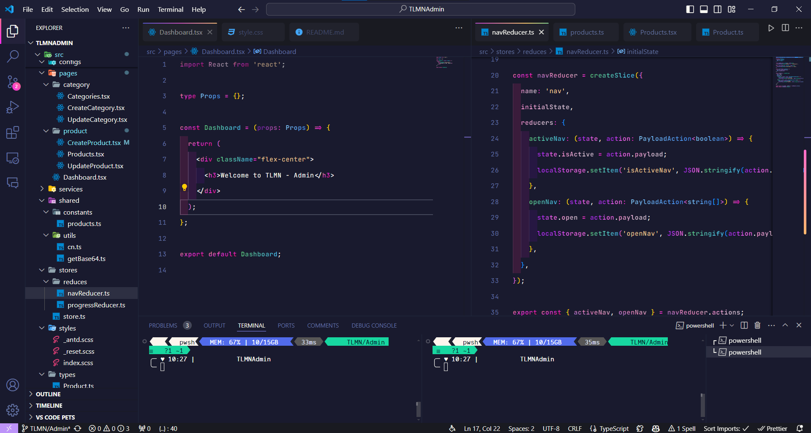

<!-- VSCode Custom CSS Imports -->
<h2 align="center">🛠 Installation and Usage 🛠</h2>
<br>

 <h1>Getting Started with VSCode Custom CSS Imports</h1>
 <p>This project allows you to customize your Visual Studio Code experience by applying your own CSS styles and themes.</p>


## Installation

1. **Install the Extension**:
   - Open Visual Studio Code.
   - Go to the Extensions view by clicking on the Extensions icon in the Activity Bar on the side of the window or by pressing `Ctrl+Shift+X` (Windows/Linux) or `Cmd+Shift+X` (macOS).
   - Search for "VSCode Custom CSS Imports" and click Install.

2. **Enable Custom CSS and JS**:
   - Open your VSCode settings (`Ctrl+,` or `Cmd+,` on macOS).
   - Search for `custom css and js`.
   - Ensure the `Custom CSS and JS` extension by `be5invis` is installed and enabled.

## Applying Your Theme

1. **Clone the Repository**:
   - Open your terminal.
   - Clone your custom theme repository:
     ```sh
     git clone https://github.com/htnhan-dev/vscode-custom.git
     ```

2. **Link Your Custom CSS**:
   - Open VSCode and go to File -> Preferences -> Settings.
   - Search for `custom css`.
   - Set the `Custom CSS and JS path` to the path of your custom CSS file. For example:
     ```json
     "vscode_custom_css.imports": [
       "file:///path/to/your/vscode-custom-theme/custom.css"
     ]
     ```

3. **Enable Custom Styles**:
   - Press `F1` to open the Command Palette.
   - Type `Enable Custom CSS and JS` and select it.
   - Reload/restart VSCode when prompted.

## Usage

- **Editing Your Theme**:
  - Make changes to your custom CSS file located in the cloned repository.
  - Save the file and see your changes take effect immediately in VSCode.

- **Switching Themes**:
  - To switch themes, simply change the `file:///path/to/your/vscode-custom-theme/custom.css` path in the settings to point to a different CSS file.

## Learn More

You can learn more in the [VSCode Custom CSS and JS documentation](https://github.com/be5invis/vscode-custom-css).

For more customization options and extensions, check out the [VSCode Marketplace](https://marketplace.visualstudio.com/vscode).

## License

This project is licensed under the MIT License. See the [LICENSE](LICENSE) file for more details.

<h2 align="center">🔥 Screenshots 🔥</h2>
<br>
<a href="#" target="_blank">
  
</a>

<br>

<h2 align="center">Contact</h2>
<br>
<div align="center">
  <a href="https://www.facebook.com/Kai3110.Kai" target="blank">
    
  </a>
  <a href="https://www.youtube.com/channel/UCGepTGAfNX83rRKp-r-iJ1w" target="blank">
    
  </a>
  <a href="https://www.linkedin.com/in/nhanhuynh" target="blank">
    
  </a>
  <a href="https://instagram.com/kaitina3116" target="blank">
    
  </a>
  <a href="mailto:nhanhuynh495@gmail.com" target="top">
    
  </a>
</div>

<br>

Enhance your Visual Studio Code experience with custom styles and themes tailored to your preference. Happy coding!
