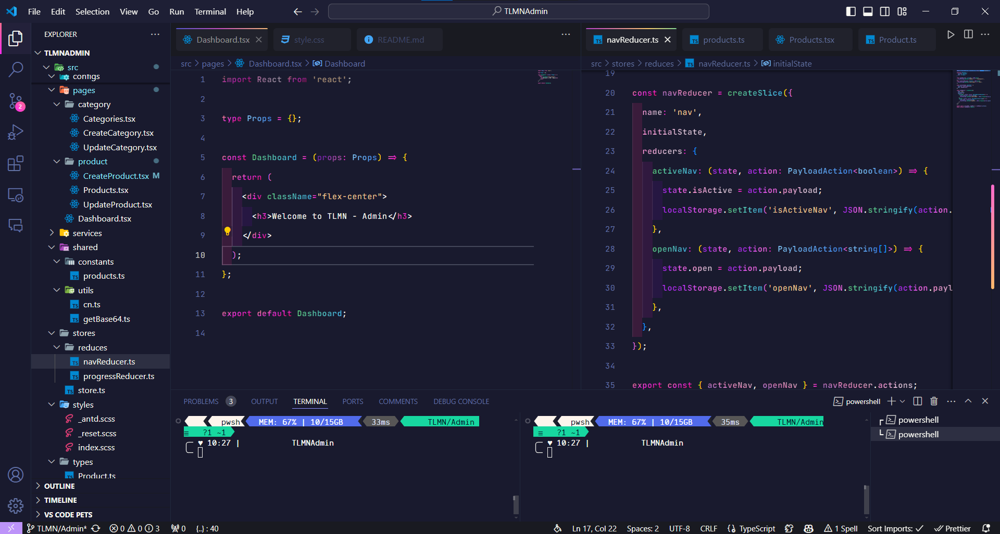

<!DOCTYPE html>
<html lang="en">
<head>
    <meta charset="UTF-8">
    <meta name="viewport" content="width=device-width, initial-scale=1.0">
    <title>README</title>
</head>
<body>
    <h1>Getting Started with VSCode Custom CSS Imports</h1>
    
This project allows you to customize your Visual Studio Code experience by applying your own CSS styles and themes.

    <h2>Available Scripts</h2>
    
In the project directory, you can run:

    <h3>npm install</h3>
    
Installs the necessary dependencies for the project.

    <h3>npm start</h3>
    
Starts the extension in development mode.

    <h3>npm run build</h3>
    
Builds the extension for production to the <code>dist</code> folder. It correctly bundles all necessary files for optimal performance.

    <h2>Installation</h2>
    <ol>
        <li>
            
<strong>Install the Extension</strong>:

            <ul>
                <li>Open Visual Studio Code.</li>
                <li>Go to the Extensions view by clicking on the Extensions icon in the Activity Bar on the side of the window or by pressing <code>Ctrl+Shift+X</code> (Windows/Linux) or <code>Cmd+Shift+X</code> (macOS).</li>
                <li>Search for "VSCode Custom CSS Imports" and click Install.</li>
            </ul>
        </li>
        <li>
            
<strong>Enable Custom CSS and JS</strong>:

            <ul>
                <li>Open your VSCode settings (<code>Ctrl+,</code> or <code>Cmd+,</code> on macOS).</li>
                <li>Search for <code>custom css and js</code>.</li>
                <li>Ensure the <strong>Custom CSS and JS</strong> extension by <code>be5invis</code> is installed and enabled.</li>
            </ul>
        </li>
    </ol>

    <h2>Applying Your Theme</h2>
    <ol>
        <li>
            
<strong>Clone the Repository</strong>:

            <pre><code>git clone https://github.com/yourusername/vscode-custom-theme.git</code></pre>
        </li>
        <li>
            
<strong>Link Your Custom CSS</strong>:

            <ul>
                <li>Open VSCode and go to File -> Preferences -> Settings.</li>
                <li>Search for <code>custom css</code>.</li>
                <li>Set the <code>Custom CSS and JS path</code> to the path of your custom CSS file. For example:</li>
                <pre><code>"vscode_custom_css.imports": [
    "file:///path/to/your/vscode-custom-theme/custom.css"
]</code></pre>
            </ul>
        </li>
        <li>
            
<strong>Enable Custom Styles</strong>:

            <ul>
                <li>Press <code>F1</code> to open the Command Palette.</li>
                <li>Type <code>Enable Custom CSS and JS</code> and select it.</li>
                <li>Reload/restart VSCode when prompted.</li>
            </ul>
        </li>
    </ol>

    <h2>Usage</h2>
    <ul>
        <li>
            
<strong>Editing Your Theme</strong>:

            
Make changes to your custom CSS file located in the cloned repository.

            
Save the file and see your changes take effect immediately in VSCode.

        </li>
        <li>
            
<strong>Switching Themes</strong>:

            
To switch themes, simply change the <code>file:///path/to/your/vscode-custom-theme/custom.css</code> path in the settings to point to a different CSS file.

        </li>
    </ul>

    <h2>Learn More</h2>
    
You can learn more in the <a href="https://github.com/be5invis/vscode-custom-css">VSCode Custom CSS and JS documentation</a>.

    
For more customization options and extensions, check out the <a href="https://marketplace.visualstudio.com/vscode">VSCode Marketplace</a>.

    <h2>License</h2>
    
This project is licensed under the MIT License. See the <a href="LICENSE">LICENSE</a> file for more details.

    <h2>Screenshots</h2>
    

    
Enhance your Visual Studio Code experience with custom styles and themes tailored to your preference. Happy coding!

</body>
</html>
